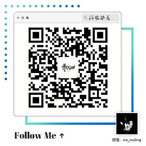

# YUVImageTest
纯C++代码，对YUV文件数据操作，通道分离、灰度处理、变暗处理。

该工程使用C++代码，分别对YUV420P和YUV444P格式的yuv文件进行了通道分离、灰度处理、变暗处理，帮助于更好地理解YUV格式，相关文章代码请看：

[#YUV格式通透解析](https://www.hxxian.cn/blog/article.html?articleId=29)

[YUV格式实战代码解析](https://www.hxxian.cn/blog/article.html?articleId=31)

更多音视频图像处理相关技术，可关注公众号或加微信，一起交流技术哦~

